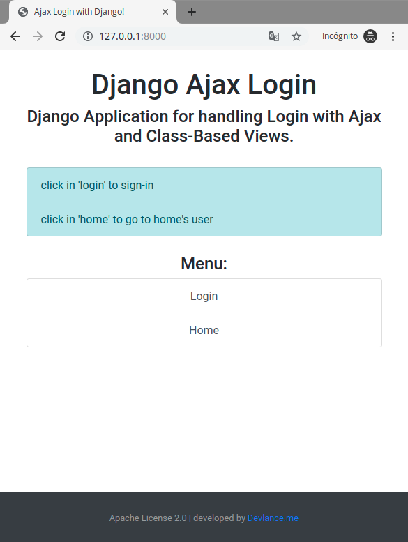
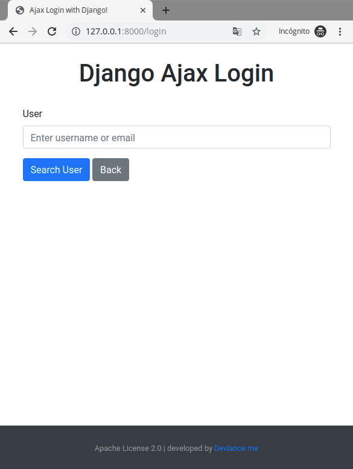
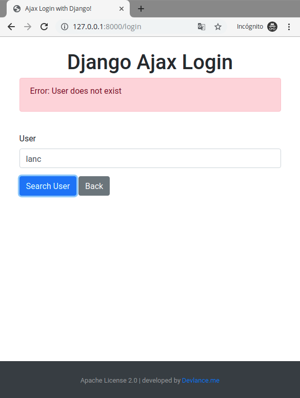
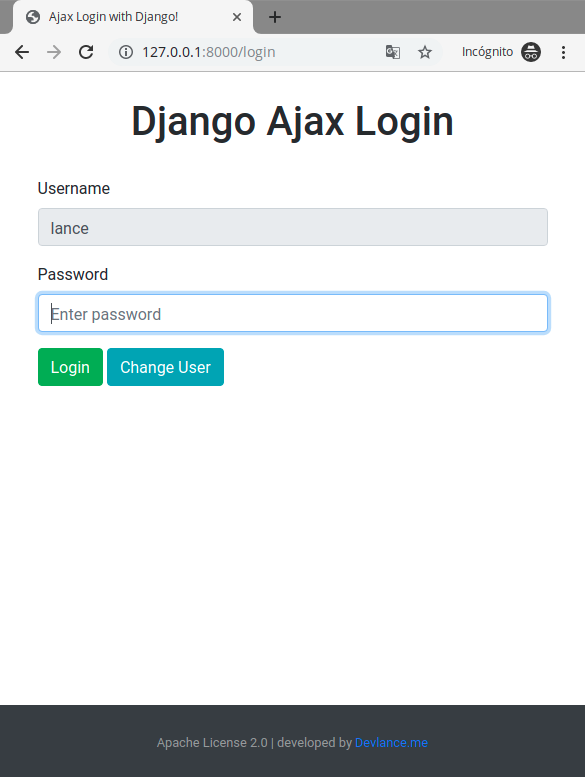
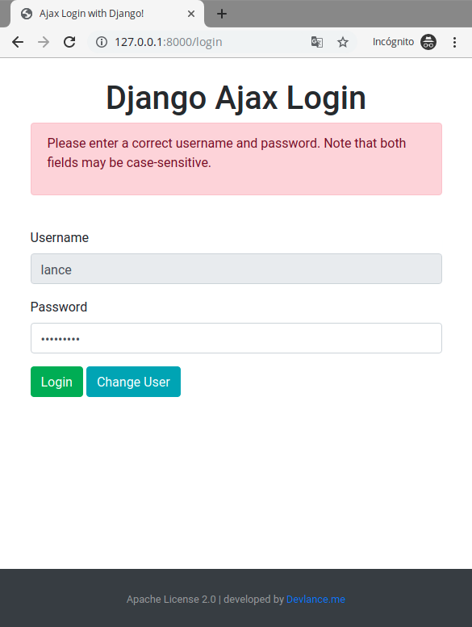
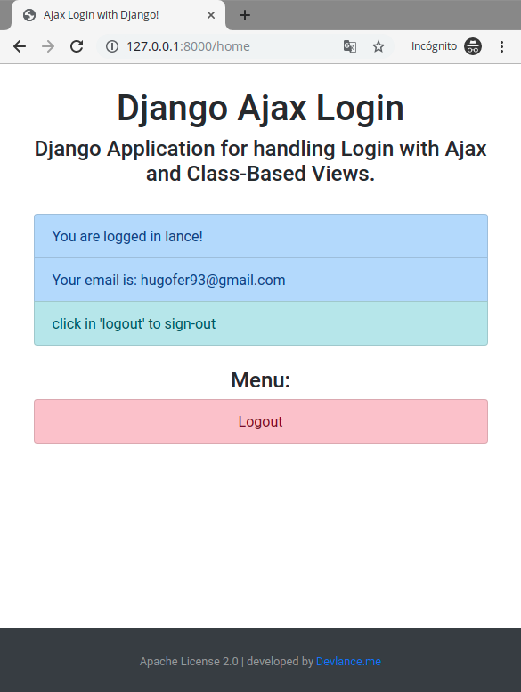

# djangoAjaxLogin
Implementation of a modern Login with Ajax in Django

* Django 2.2.4 LTS
* jQuery 3.3.1 Slim
* Bootstrap 4.3.1
* Axios 0.19

#### Note:
* User Search by email or username
* Disabled username field, it's automatically filled in with the user search
* Class-Based Views
* Render Form (GET Method)
* Submit (POST Method / AJAX)
* CSRF Token Handling (Axios)
* Error Handling and Validations

# Captures:
## Index View

## Login View - Search User

## Login View - Search User with error

## Login View - Login Form after the search

## Login View - Login Form with error

## Home View - Only logged in users

## Logout View - Return to Index View